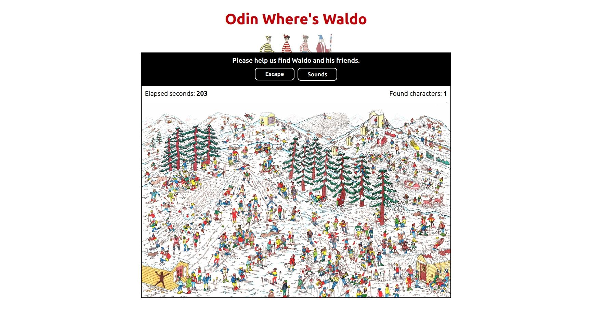

# [Odin Where's Waldo](https://odinwhereiswaldo.pages.dev/)

A web-based **"Where's Waldo"** game built as part of studying [The Odin Project's Node.js course](https://www.theodinproject.com/lessons/nodejs-where-s-waldo-a-photo-tagging-app).

**Game Description** (from The Odin Project):

> Have you ever played [Where’s Waldo](https://en.wikipedia.org/wiki/Where%27s_Wally%3F)? If not, here’s the idea: you are presented with a crowded illustration full of characters, objects, and details. Your task is to find a specific character named Waldo, hidden somewhere in the scene.



This repository contains the **front-end application**, which communicates with the back-end API from the [Generic Express Service](https://github.com/hussein-m-kandil/generic-express-service).

This is my **first Angular project**, and I intentionally avoided using external JavaScript or TypeScript libraries to focus on deepening my understanding of **Angular** and **RxJS**.

The app uses **Angular’s new Vitest-based testing system** for all tests. Component tests are written with the [Angular Testing Library](https://testing-library.com/docs/angular-testing-library/intro)
, while service tests rely on Angular’s built-in testing utilities.

---

## Features

- Detects pointer position to select a character in the crowded image.
- Evaluates selections with correct/incorrect feedback.
- Timer tracking total completion time.
- Toggleable, interaction-based sound effects.
- Ranked list of finders and their completion times.

---

## Technologies

- **TypeScript v5**
- **Angular v20**
- **RxJS v7**
- **Tailwind CSS v4**
- **Vitest v3**
- **JSDOM v27**
- **Angular Testing Library v18**

---

## Local Development

### Requirements

- [Angular CLI v20](https://angular.dev/installation#install-angular-cli) installed globally.
- A local clone of [Generic Express Service](https://github.com/hussein-m-kandil/generic-express-service).

### Setup

#### 1. Clone and set up the backend

_Refer to the [Generic Express Service repository](https://github.com/hussein-m-kandil/generic-express-service) for more information_.

```bash
git clone git@github.com:hussein-m-kandil/generic-express-service.git
cd generic-express-service
npm install
# Configure the .env file (DB connection, ports, etc.)
cp .env.test .env
# Start PostgreSQL via Docker Compose
npm run pg:up
# Build and start the backend in production mode
npm run build
npm start
```

The app should be available at [http://localhost:8080](http://localhost:8080).

#### 2. Clone and set up this project

```bash
git clone git@github.com:hussein-m-kandil/odin-where-is-waldo.git
cd odin-where-is-waldo
npm install
# Copy the environment file for development
cp src/environments/environment.development.ts src/environments/environment.ts
# Run tests to verify setup (optional)
npm run test -- --run
# Start the development server
npm start
```

The app will be available at [http://localhost:4200](http://localhost:4200).

---

## Scripts

| Command              | Description                                    |
| -------------------- | ---------------------------------------------- |
| `npm install`        | Installs dependencies.                         |
| `npm start`          | Starts the development server.                 |
| `npm test`           | Runs all project tests.                        |
| `npm lint`           | Checks for linting issues.                     |
| `npm run build`      | Builds the project for production.             |
| `npm run type-check` | Type-checks all source files.                  |
| `npm run build:zip`  | Builds the project and zips the browser files. |
